# Openlane-Sky130-Workshop
An advanced workshop on Sky130 which deals with RTL to GDSII design flow. This workshop helped me to explore on open source tools in Physical design. It gave a thorough understanding of SoC design flow using the open source EDA tools like Google's Skywater which is process design kit on 130nm. Workshop mainly deals with design and characterisation of own standard cell and generating netlist, GDSII flow from RTL. Netlist generation, logic synthesis, placement, floor planning, power planning, timing analysis and routing are done on own design. SPEF extraction, SDC files, library files, cell library files, timing library files and technology files are generated for full design flow. Timing modelling with ideal clock and real clock is done using delay tables, clock tree synthesis,  and signal integrity  is done. Main tools on which complete design flow goes are  OpenSTA, Tritonroute, Yosys, SPEF extractor, NGSPICE and OPENROAD. 

   # Contents:
   #### 1. INTRODUCTION TO SoC & SYNTHESIS
   #### 2. FLOORPLANNING & PLACEMENT 
   #### 3. STANDARD CELL_INVERTER LAYOUT & DRC
   #### 4. STATIC TIMING ANALYSIS & CLOCK TREE SYNTHESIS
   #### 5. ROUTING & SPEF EXTRACTION

## 1.INTRODUCTION TO SoC & SYNTHESIS
   Brief about SoC/Processor architecture
   Overview of modules in SoC
   Nominclature of SoC as one of the packages QFN-48 ( Quad Flat No leads 48 pin) with typically size of 7mm x 7mm chip placed in middle of package connected to pins with wire bonds.
 
 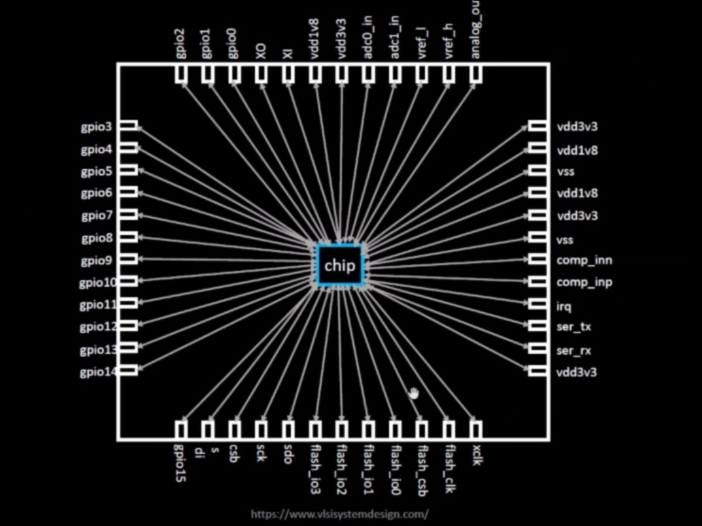
 
   In chip, important components are pads, core and die. These pads are through which we send signals from outside the environment into the chip. Core is placed where all the logic is implemented.
   
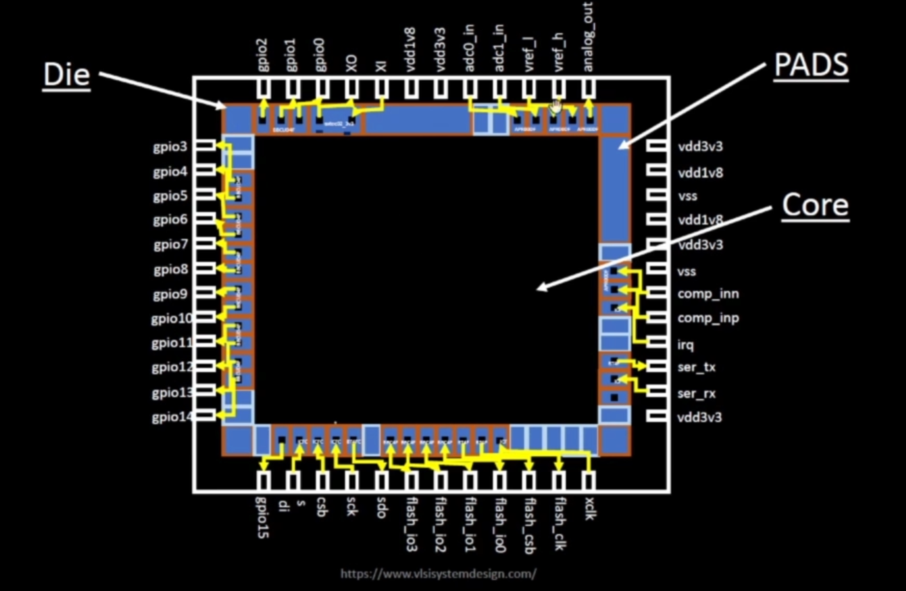

   
   RISC-V architecture has interface with different modules like analogue IPs, macros like digital blocks, SRAM, ADCs and DACs. These all are designed using verilog(.v file) and these files are usually RTL files which are used to generate netlist which further used for generation placement & routing. Placement and routing is done which also includes floor planning and power planning.
   
  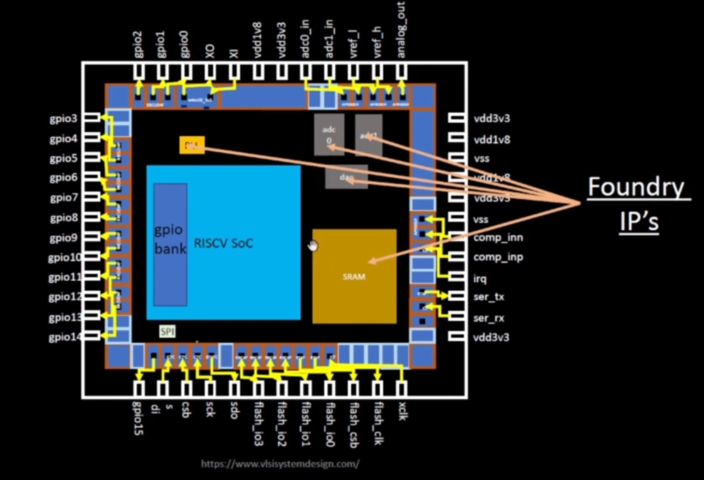
  
  All the apps are written in C language which is not understood by machine or processor. This language is converted into binary/ assemble language. In order to make processor understand the process, there is interface that is present in between RISC-V and layout flow is hardware/physical layer which deals with verilog hardware language. In this process, processor spec using RTL generates netlist and using library files & tech files and finally P&R flow is implemented
  
 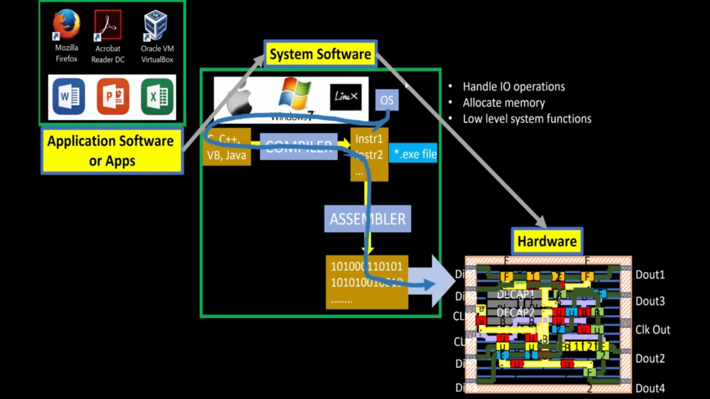
 
 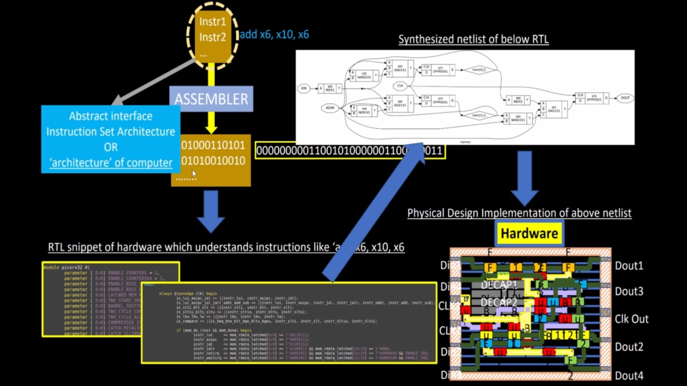
 
 
   Basic RTL is converted to circuit, out of components from standard cell library. These library cells are typically regular layouts with fixed height in a rectangle. Each cell has different views/models
   In floor planning, partition the chip die between different system building blocks and IO pads. Macros floor planning dimensions, pin locations, rows definitions. Power planning is done on upper metal layers because those are thicker than lower metal layers. Hence less resistance for power loss. 
   Placement is done in two steps: global & detailed.  Global finds optimal position for all cells.
   
   
 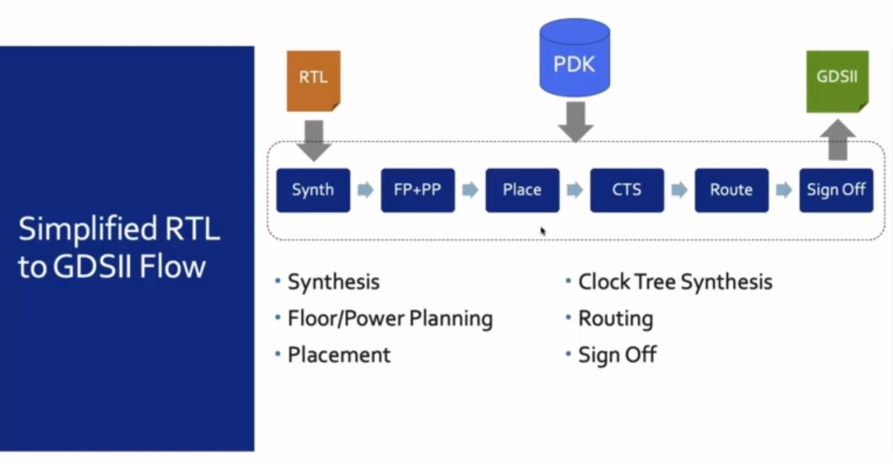
 
 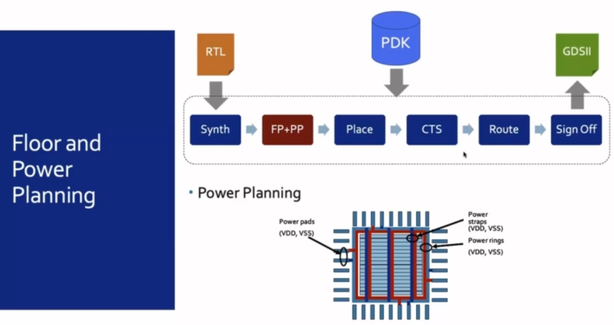
 
   Before synthesis, we have to prepare the design where it merges both files - CELL level and TECH level into one.
   First, preparation of the design in OpenLANE merges the technology LEF and cell LEF files. Tech LEF file contains layer definitions and a set of restricted design rules needed for PnR flow. The cell LEF  file has obstruction information of each standard cell needed to minimize DRC errors during PnR flow:
   
  Invoking Openlane using below commands in the file path:
               
               /home/chaitanya/Desktop/vsdflow/work/tools/openlane_working_dir/openlane/
               
   Below commands to invoke openlane:
   
                  docker run -it -v $(pwd):/openLANE_flow -v $PDK_ROOT:$PDK_ROOT -e PDK_ROOT=$PDK_ROOT -u $(id -u $USER):$(id -g $USER) openlane:rc2
                  
   /flow.tcl is the script which runs the OpenLANE flow and also we can run in autonomous mode. In order to run step wise we can use " -interactive" mode
   
               In bash: ./flow.tcl -interactive
               
   Below commands are used to prepare design and tag them to folder for further analysis.
   
               prep -design picorv32a -tag workshop
               
 
 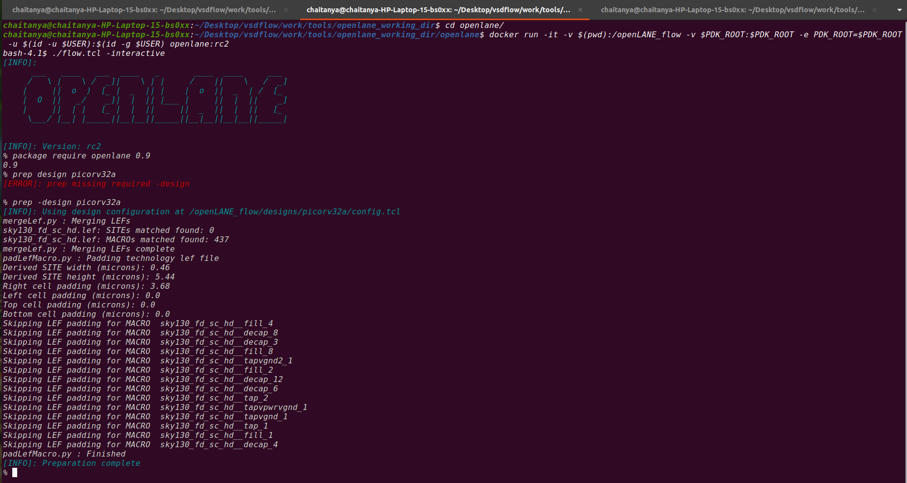
 
 
 In run folder we can see the merge file got created, where we get CELL & TECH level info.
 
               /home/chaitanya/Desktop/vsdflow/work/tools/openlane_working_dir/openlane/designs/picorv32a/runs/run29_1
 

 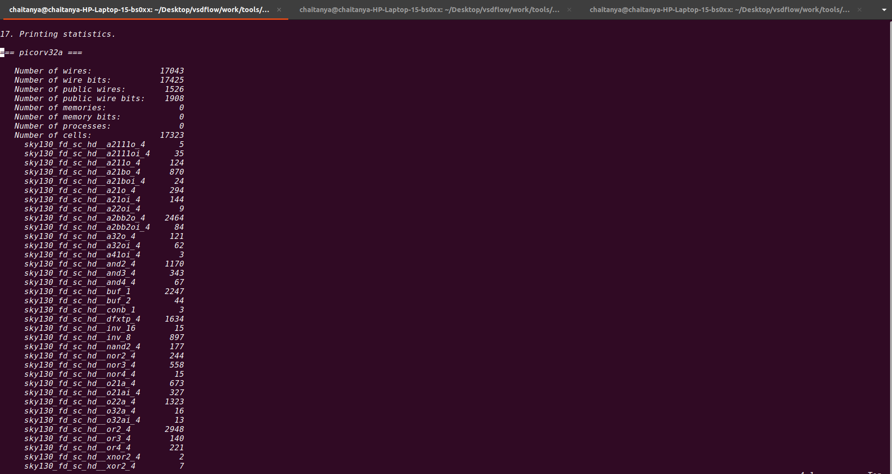
 
 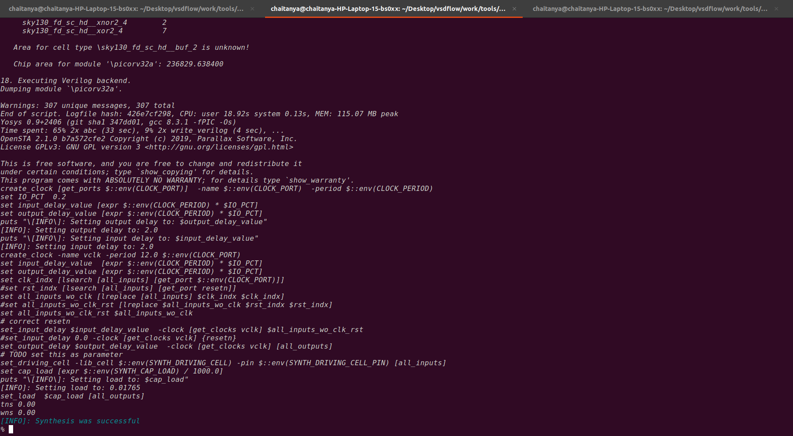

## 2. FLOORPLANNING & PLACEMENT 

In order to find the size of chip/block and Aspect ratio, the core area and IO core spacing and Floor Plan and Power Network with horizontal metal layer. IO Placement/Pin placement and I/O Pin Rings for Blocks. Using the command in openlane floorplan is run.

                     % run_floorplan

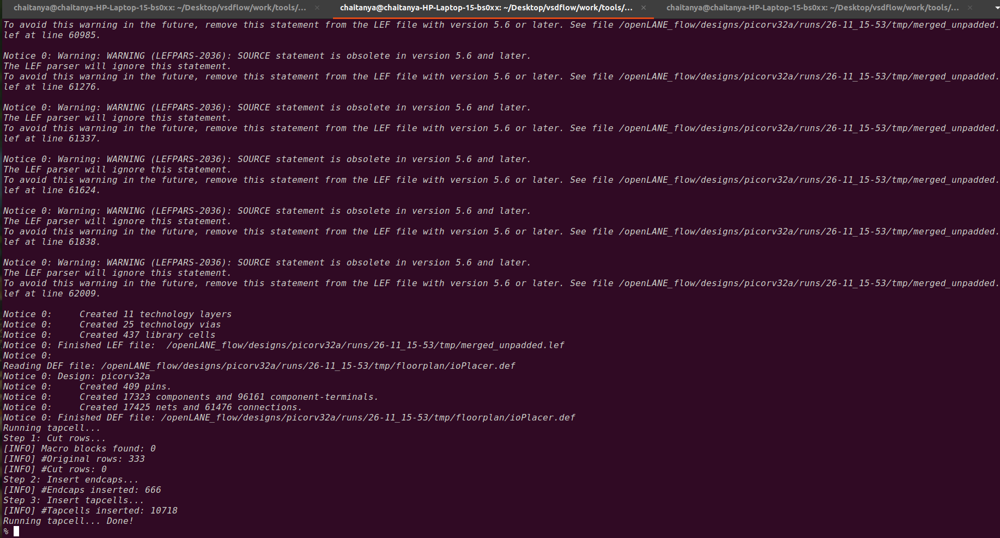

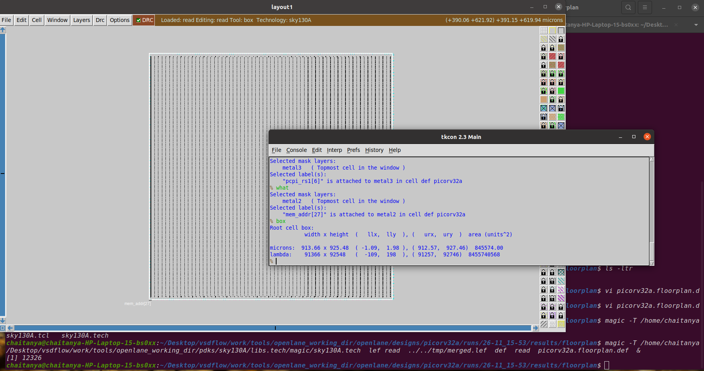

After floorplan is run ,magic command for floorplan.def file :
               
In the path we have to enter the command /openlane/designs/picorv32a/runs/run29/results/floorplan$ 
         
         magic -T /home/chaitanya/Desktop/vsdflow/work/tools/openlane_working_dir/pdks/sky130A/libs.tech/magic/sky130A.tech lef read ../../tmp/merged.lef def read picorv32a.floorplan.def
         
 For viewing metal layers and pin we have to zoom in for the pins using  'z' and for zoom out 'shift+z'

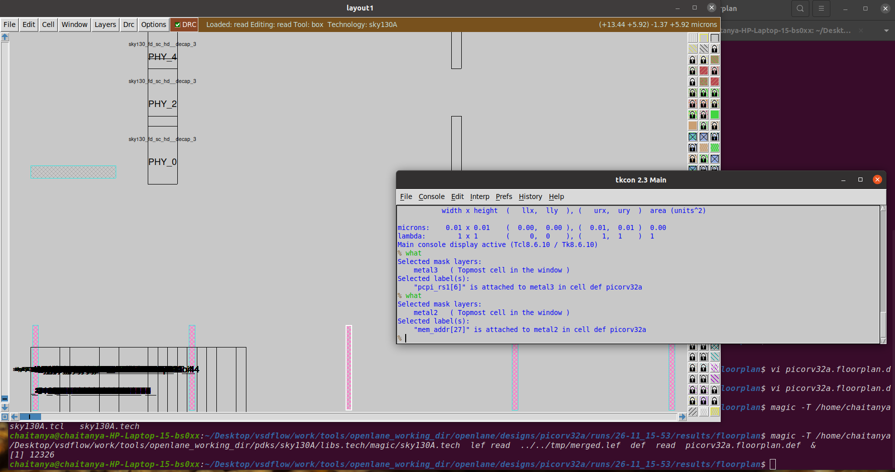

For IO_MODE, we have to enable the switch: Enabling the IO pins using a switch with a parameter called  FP_IO_MODE

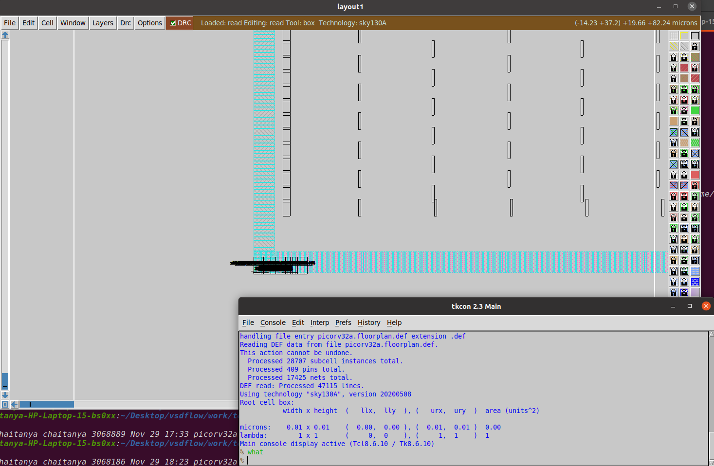

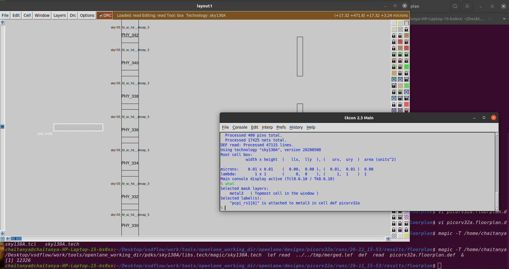

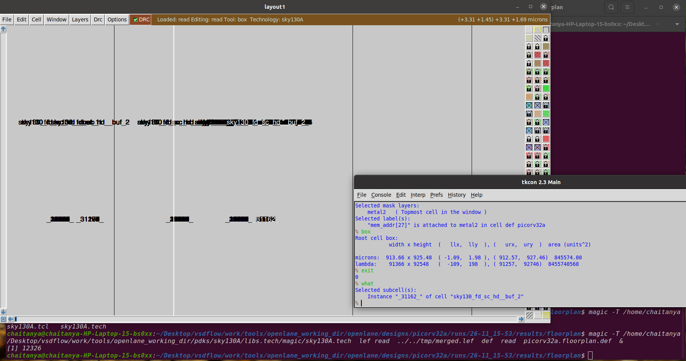

## 3. STANDARD CELL_INVERTER LAYOUT & DRC

   ### Git clone the standard cell from VSDSTDCELL design
   
   
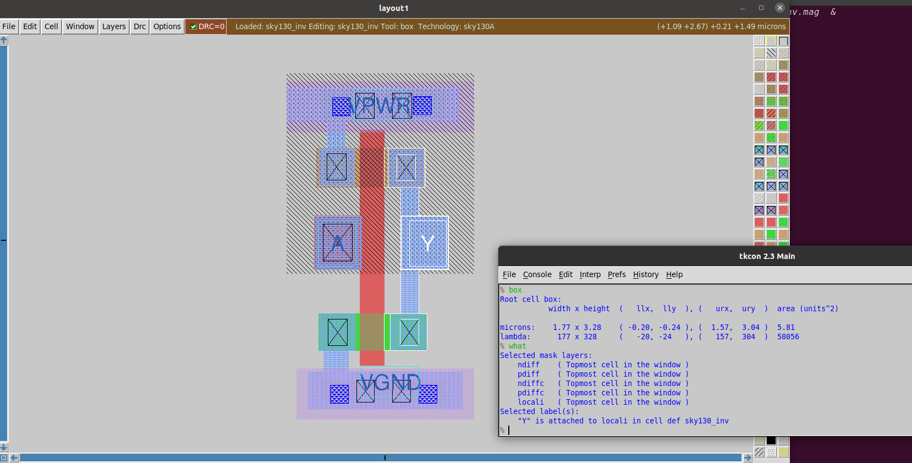

  
  For analysing the inverter response by giving a pulse input at the input port A and plugging at output port Y.
 here below in image we can see the process of runinng NGSPICE and plotting the response.
   
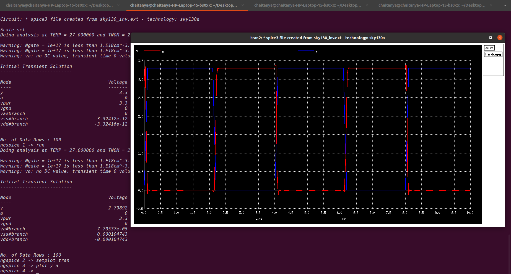

After doing analysis and layout the parasitic extraction is done using the steps in the image.

               Commands:
               
                     % extractall
                     % ext2spice cthresh 0 rthresh 0   //which extracts all parasitics from threshold 0
                     % ext2spice   // which creates spice file for access.

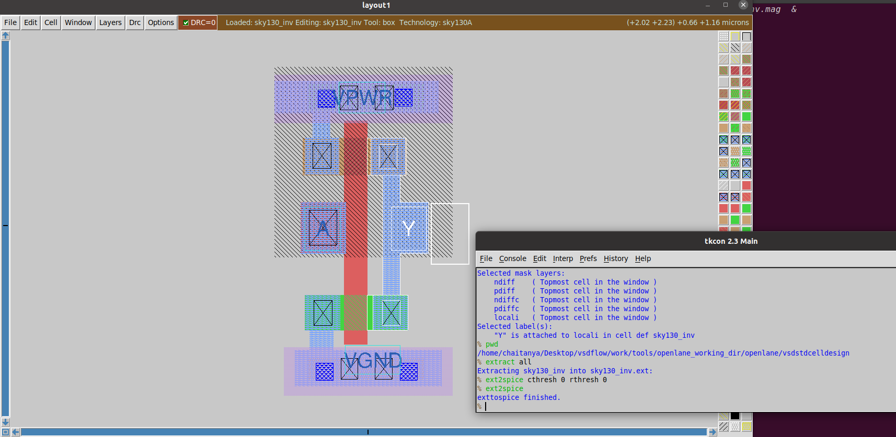

  ### Identification of NMOS and PMOS in LAYOUT:
  
  

 
 ### STANDARD CELL- INVERTER_TRANS CHARACTERISTICS
 
 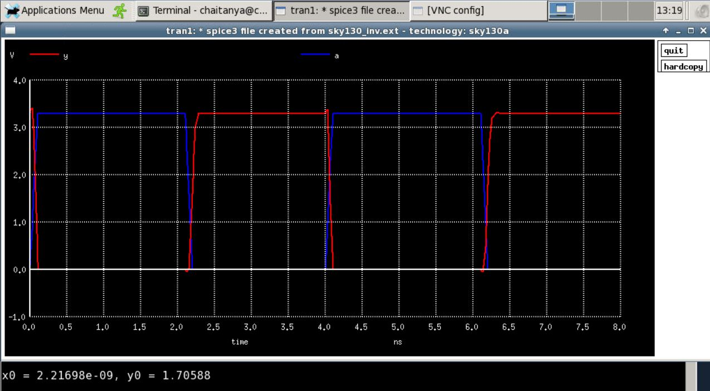
 
 
 
 ### 4. STATIC TIMING ANALYSIS & CLOCK TREE SYNTHESIS
 
 
 
 
 
 
 ### 5. ROUTING & SPEF EXTRACTION
