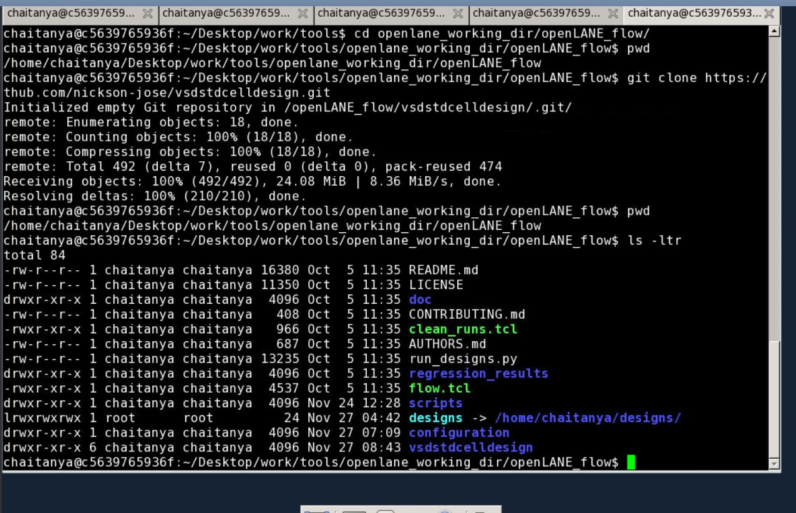
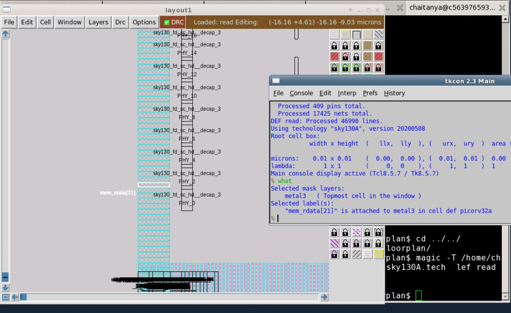
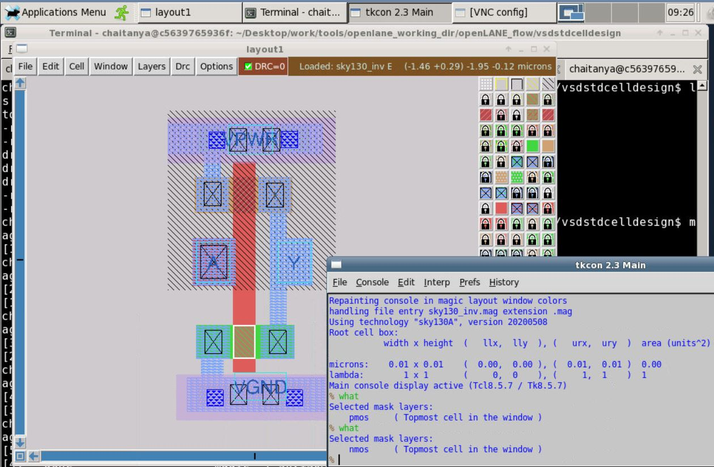
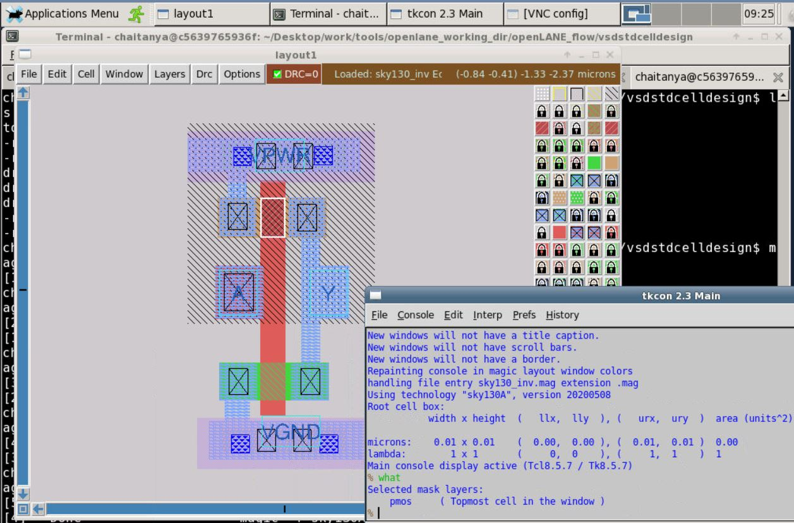

# Openlane-Sky130-Workshop
An advanced workshop on Sky130 which deals with RTL to GDSII design flow. This workshop helped me to explore on open source tools in Physical design. It gave a thorough understanding of SoC design flow using the open source EDA tools like Google's Skywater which is process design kit on 130nm. Workshop mainly deals with design and characterisation of own standard cell and generating netlist, GDSII flow from RTL. Netlist generation, logic synthesis, placement, floor planning, power planning, timing analysis and routing are done on own design. SPEF extraction, SDC files, library files, cell library files, timing library files and technology files are generated for full design flow. Timing modelling with ideal clock and real clock is done using delay tables, clock tree synthesis,  and signal integrity  is done. Main tools on which complete design flow goes are  OpenSTA, Tritonroute, Yosys, SPEF extractor, NGSPICE and OPENROAD. 

   # Contents:
   ### 1. Introduction to SoC and Synthesis
   ### 2. FLOORPLANNING  
   ### 3. STANDARD CELL_INVERTER LAYOUT & DRC
   ### 4. Day 4
   ### 5. Day 5

   ## 1.Introduction to SoC and Synthesis
   Brief about SoC/Processor architecture
   Overview of modules in SoC
   Nominclature of SoC as one of the packages QFN-48 ( Quad Flat No leads 48 pin) with typically size of 7mm x 7mm chip placed in middle of package connected to pins with wire bonds.
 
 
 
   In chip, important components are pads, core and die. These pads are through which we send signals from outside the environment into the chip. Core is placed where all the logic is implemented.
   

   
   RISC-V architecture has interface with different modules like analogue IPs, macros like digital blocks, SRAM, ADCs and DACs. These all are designed using verilog(.v file) and these files are usually RTL files which are used to generate netlist which further used for generation placement & routing. Placement and routing is done which also includes floor planning and power planning.
   
  
  
  All the apps are written in C language which is not understood by machine or processor. This language is converted into binary/ assemble language. In order to make processor understand the process, there is interface that is present in between RISC-V and layout flow is hardware/physical layer which deals with verilog hardware language. In this process, processor spec using RTL generates netlist and using library files & tech files and finally P&R flow is implemented
  
 
 
 
 
 
   Basic RTL is converted to circuit, out of components from standard cell library. These library cells are typically regular layouts with fixed height in a rectangle. Each cell has different views/models
   In floor planning, partition the chip die between different system building blocks and IO pads. Macros floor planning dimensions, pin locations, rows definitions. Power planning is done on upper metal layers because those are thicker than lower metal layers. Hence less resistance for power loss. 
   Placement is done in two steps: global & detailed.  Global finds optimal position for all cells.
   
   
 
 
 
 
 
 

 
 
 

## 2. FLOORPLANNING

## 3. STANDARD CELL_INVERTER LAYOUT & DRC

   ### Git clone the standard cell from VSDSTDCELL design
   
   

   ### Enabling the IO pins using a switch with a parameter called  FP_IO_MODE
   
   

   ### Identifying Multiple layers of inverter in tcl command promt
   

  ### Identification of NMOS and PMOS in LAYOUT:
   
   
 
 
 
 
 ### CELL_TRANS CHARACTERISTICS
 
 
